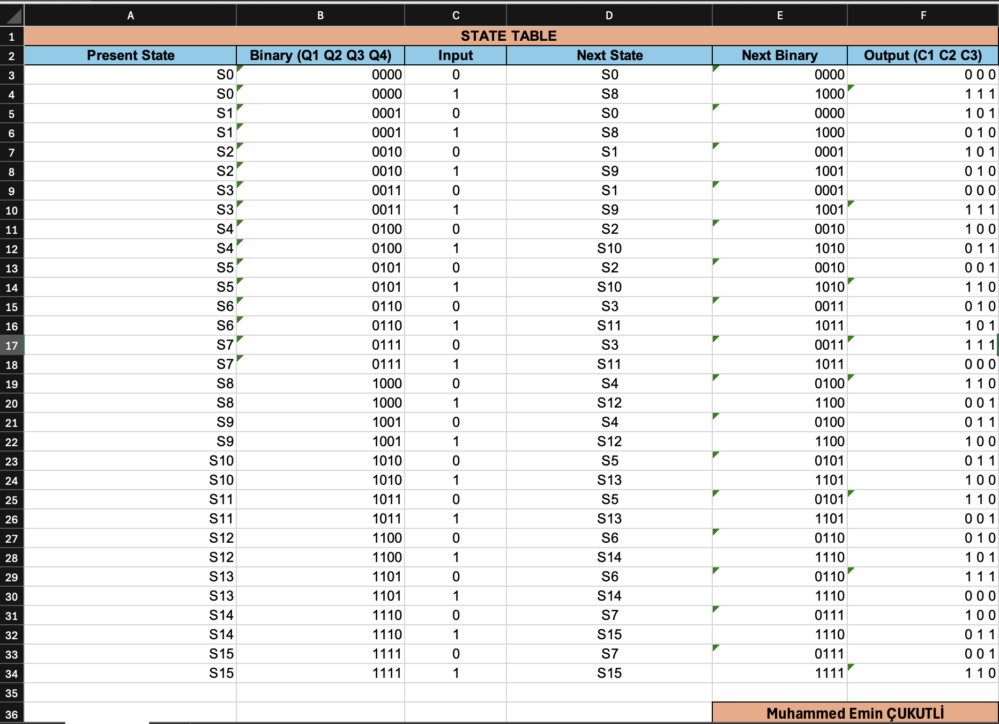
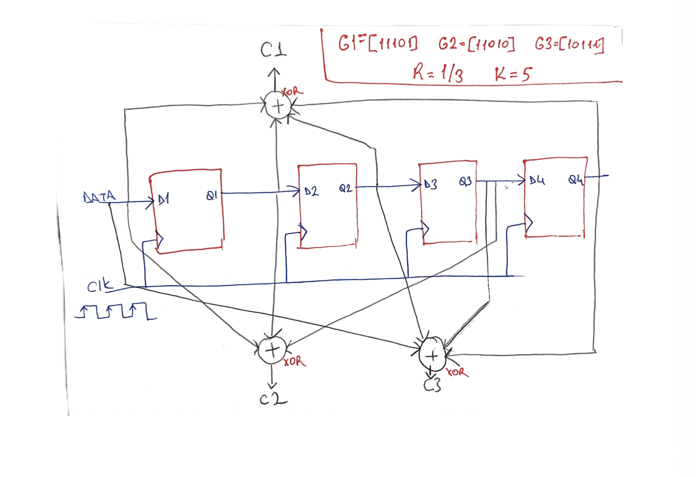
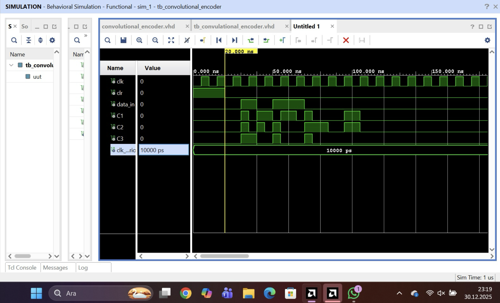

# R=1/3 Convolutional Encoder VHDL Design & Simulation

## 📌 Project Overview
This project involves the design, finite state machine (FSM) analysis, and FPGA simulation of a **Constraint Length K=5, Coding Rate R=1/3 Convolutional Encoder** using VHDL in Xilinx Vivado. The system processes serial input data through shift registers and generates coded output streams ($C_1, C_2, C_3$) based on defined generator polynomials.

---

## ⚙️ Specifications & Generator Polynomials
* **Coding Rate (R):** 1/3
* **Constraint Length (K):** 5
* **Generator Polynomials:** 
  * $G_1 = [11101]$
  * $G_2 = [11010]$
  * $G_3 = [10111]$
* **Outputs:** CodeWord = $[C_1\ C_2\ C_3]$

---

## 📊 Design & Implementation

### 1. State Table
Derivation of 16 present/next states ($S_0$ to $S_{15}$) based on serial binary input and current register memory:

### 2. State Transition Diagram
Complete color-coded state diagram displaying all valid transitions and corresponding 3-bit codeword outputs:

### 3. Hardware Architecture & Logic Schematic
Schematic implementing 4 D-Flip-Flops ($D_1 - D_4$) with XOR-based modulo-2 adders connected according to the generator polynomials:

### 4. Behavioral Simulation Results
Functional simulation waveform in Xilinx Vivado verifying clock synchronization, state shifts, and expected output bits:

